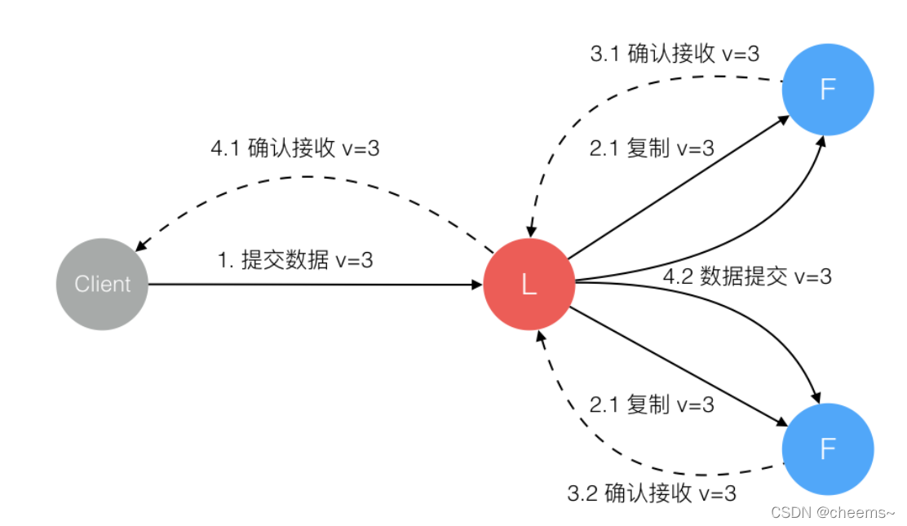

#Golang实现Raft一致性算法
# 前言
本文在理解raft算法的基础上，实现了简易版的raft算法
[github源码地址](https://github.com/gopherWxf/raft)

# 流程分析
//TODO 明天再优化流程图,累了

# 功能实现
- 节点状态分为Leader（领导者）、Follower（追随者）、Candidate（候选人）
- 节点间随机成为candidate状态并选举出Leader，且同时仅存在一个Leader
- Leader节点定时发送心跳检测至其他Follower节点
- Follower节点们超过一定时间未收到心跳检测，则Follower节点们重新开启选举
- 客户端通过http发送消息到节点A，如果A不是Leader则转发至Leader节点
- Leader收到客户端的消息后向Follower节点进行广播
- Follower节点收到消息，反馈给Leader，等待Leader确认
- Leader收到全网超过二分之一的反馈后，本地进行打印，然后将确认收到反馈的信息提交到Follower节点
- Follower节点收到确认提交信息后，打印消息
# 运行步骤与测试
1. 下载/编译

```bash
//从git上克隆源代码下来
git clone git@github.com:gopherWxf/raft.git
```
```bash
//进入该文件夹进行编译
go build main.go
```


2. 开启三个端口，并分别执行main.exe A 、main.exe B 、 main.exe C，代表开启三个节点（初始状态为追随者）
   
3. 三个节点会随机选举出领导者（其中每个节点默认监听来自http的访问，端口为节点端口+2000）,成功的节点会发送心跳检测到其他两个节点
   
4. 此时打开浏览器用http访问每个节点的端口加上2000，带上节点需要同步打印的消息，比如：
```bash
http://localhost:8870/req?message=I
http://localhost:8871/req?message=Love
http://localhost:8872/req?message=You
```


可以看到三个节点同时打印了消息，本段数据同步步骤可以用下图进行理解（不过缺少了4.1步骤）

5.  如果领导者节点宕机了怎么办呢，我们尝试关闭领导者节点C
    

    可以发现关闭领导者B后，节点间有个超时机制，如果超过一定时间没有收到心跳检测，则会自动开始重新进行选举，此时B当选了新的领导者

6. 重新启动节点C，C自动变为追随者状态，并接收来自新的领导者B的心跳检测
   

# 参考资料

[corgi-kx/blockchain_consensus_algorithm
](https://github.com/corgi-kx/blockchain_consensus_algorithm/tree/master/raft)


[看动画轻松学会 Raft 算法](https://www.cnblogs.com/Finley/p/14467602.html)

[Toggle navigationThe Secret Lives of Data-CN](https://acehi.github.io/thesecretlivesofdata-cn/raft/)